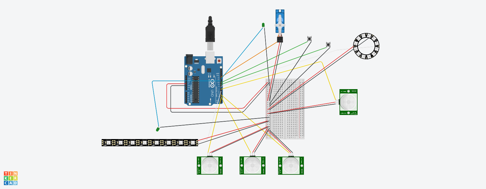

# Description
Le projet parle du bouturage de coraux en eaux profondes.

Ces coraux poussent d'1cm par an selon les espèces donc ce sont des coraux très importants à préserver et compliqués à protéger dû aux conditions extrêmes (profondeur, pression, manque de luminosité…) dans lesquelles ils poussent.

Notre projet porte donc sur des modules en biociment géo adaptatif aux fonds marins, le bouturage sur ces

# Participants
Ecole de design Nantes Atlantique:
- Eloane lefebvre
- Jean Bastien-Thiry 
- Celia Lammoglia

Polytech Nantes:
- Coraleen Cucherat
- Tinglan Yang

# Description technique
## Description générale
Le projet est composé de deux parties:
- une partie Arduino qui gère les interactions mécaniques (activer le moteur, allumer les LED...)
- une partie Processing qui gère l'interaction entre l'écran, l'utilisateur et l'Arduino

Ces deux parties sont dépendantes l'une de l'autre et communiquent via le port COM (usb) afin de notifier les changements d'états notamment les débuts et fins d'étapes (exemple: Processing envoie à Arduino "debut bouturage", Arduino gère la partie bouturage jusqu'à sa fin puis Arduino envoie à Processing "fin de la partie bouturage").

## Matériel nécessaire
- 1 ordinateur avec deux ports USB et un branchement HDMI
- 1 écran
- 1 Airbar 14 pouces
- 1 carte Arduino Uno
- 1 breadBoard
- 1 ruban de 8 LED RGB
- 4 Capteurs Hall (avec 4 aimants au total)
- 2 LED simple
- 1 moteur servo continuous
- 2 boutons
- 1 ring de 12 LED

## Logiciels nécessaire
 - "Arduino IDE" pour modifier le code Arduino
- Processing pour modifier la partie Processing

## Partie Arduino
La partie Arduino combine la gestion de capteurs magnétiques, de LEDs, de 2 boutons et d'un moteur servo continuous pour créer un système interactif.

Il est composé de deux parties:
- la partie bouturage utilisant 1 LED d'état pour montrer que c'est le moment du bouturage, 3 capteurs Hall pour détecter les coraux qui se posent sur les socles et 1 ruban LED qui s'allume pour chaque corail déposé.
- la partie moteur utilisant 1 LED d'état pour montrer que c'est le moment du larguage, 1 moteur pour monter et descendre le module, 2 boutons pour contrôler le moteur, 1 capteur Hall pour détecter l'arrivée du module au sol et 1 ring LED pour illuminer le module une fois au sol.

## Partie Processing
Processing gère le lien entre les interactions de l'utilisateur et la vidéo.

- la vidéo est en boucle les 3 premières secondes.
- Quand l'utilisateur clique sur l'écran elle continue jusqu'au moment où l'utilisateur doit effectuer le bouturage avec les coraux
- Quand l'utilisateur a fini le bouturage, la vidéo se lance jusqu'au larguage
- Quand l'utilisateur a fini le larguage, la vidéo se lance jusqu'à la fin et redémarre à la boucle du début

# Procédure d'installation
## Branchement Arduino
Attention ! Les couleurs correspondent aux câbles direct et non aux rallonges potentielles entre l'élément et la BreadBoard.

En tout premier, il faut brancher le port 5V de la carte Arduino au premier + de la breadBoard et un port GND au premier - de la breadBoard.

Ensuite le branchement des composants:

| Pin Digital | Composant                              | Couleur                   | Alimentation sur BreadBoard (les rouges et noirs fonctionnent par pair)|
|-----|------------------------------------------------|---------------------------|---------------------------------|
| 0   | X                                              |                           |                                 |
| 1   | X                                              |                           |                                 |
| 2   | Capteur Hall du premier corail + aimant        | Jaune (blanc non branché) | Rouge sur +, noir sur -         |
| 3   | Capteur Hall du second corail + aimant         | Jaune (blanc non branché) | Rouge sur +, noir sur -         |
| 4   | Capteur Hall du troisième corail + aimant      | Jaune (blanc non branché) | Rouge sur +, noir sur -         |
| 5   | X                                              |                           |                                 |
| 6   | Ruban LED boutures                             | Blanc                     | Rouge sur +, noir sur -         |
| 7   | Capteur Hall du larguage + aimant              | Jaune (blanc non branché) | Rouge sur +, noir sur -         |
| 8   | Ring LED (branché sur IN, voir photo)          | Blanc                     | Rouge sur +, noir sur -         |
| 9   | Bouton DOWN (voir photo pour branchement)      | Vert                      | Noir sur -                      |
| 10  | Bouton UP (voir photo pour branchement)        | Vert                      | Noir sur -                      |
| 11  | LED état bouture                               | Bleu                      | Noir sur -                      |
| 12  | LED état larguage                              | Bleu                      | Noir sur -                      |
| 13  | Moteur servo continuous                        | Orange                    | Rouge sur +, noir sur -         |

## Branchement de l'écran
- coller l'air bar au bas de l'écran
- brancher l'écran à une prise
- brancher l'écran en HDMI à l'ordinateur
- brancher l'air bar à l'ordinateur à l'aide d'une rallonge USB

# Procédure de lancement
- faire les branchements de l'Arduino
- faire les branchements de l'écran
- brancher la carte Arduino Uno à un port usb de l'ordinateur
- trouver le numéro du port COM de la carte Arduino (identifiable dans l'application "Arduino IDE" ou par tout autre moyen)
- lancer l'application Processing
- ouvrir le code
- modifier "COM3" par le numéro du port COM actuel dans le code à la ligne "myPort = new Serial(this, "COM3", 9600);"
- appuyer sur le bouton "Exécuter"
- la vidéo devrait se lancer dans une nouvelle fenêtre

# A corriger
- le moteur qui tourne tout seul quand des LEDs sont utilisées

# Potentielles améliorations
- mettre en plein écran
- mettre un bouton "échap" ou "passer au bouturage" sur la vidéo (et le rendre interactif)
- faire que le moteur s'active à la fin de la vidéo pour remonter automatiquement (une fois le problème qui fait qu'il tourne tout seul corrigé)
